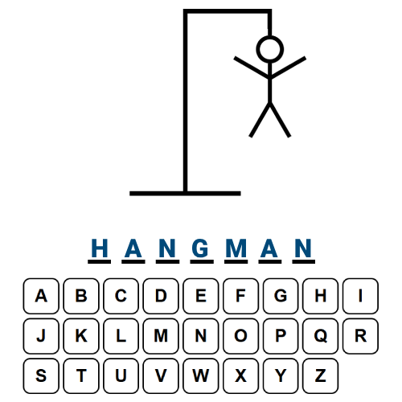

<a id="readme-top"></a>

<!-- Overview -->
<div align="center">
<a href="https://www.linkedin.com/in/pinguljan/">
    
</a>

### Hangman with React + TypeScript

<p>
    The project is from <a href="https://github.com/WebDevSimplified">WebDevSimplified</a>'s YouTube tutorial.
    <br>
    <a href="https://www.youtube.com/watch?v=-ONUyenGnWw">This Is A Great Beginner React/TypeScript Project</a>
</p>
</div>

<!-- Table of Contents -->
<details>
    <summary>
        Table of Contents
    </summary>
    <ol>
        <li>
            <a href="#about-the-project">About the Project</a>
            <ul>
                <li>
                    <a href="#difference-with-the-source">Difference with the Source</a>
                </li>
                <li>
                    <a href="#built-with">Built With</a>
                </li>
            </ul>
        </li>
        <li>
             <a href="#getting-started">Getting Started</a>
             <ul>
                <li>
                    <a href="#prerequisites">Prerequisites</a>
                </li>
                <li>
                    <a href="#installation">Installation</a>
                </li>
            </ul>
        </li>
        <li>
            <a href="#what-i-learned-and-gained">What I Learned and Gained</a>
        </li>
        <li>
            <a href="#acknowledgements">Acknowledgements</a>
        </li>
    </ol>
</details>

<!-- About the Project -->

## About the Project

<div align="center">
    
</div>

A hangman game created through the usage of React and TypeScript. Primarily focusing on the usage of Hooks, Callbacks + Closures, and proper usage of props.

<p align="right">(<a href="#readme-top">back to top</a>)</p>

### Difference With The Source

The project contains JSDocs that may aid others in understanding the logic used.


<p align="right">(<a href="#readme-top">back to top</a>)</p>

### Built With

The project was built using the following tools:

- [](https://www.typescriptlang.org/)
- [](https://react.dev/)
- [](https://vite.dev/)

<p align="right">(<a href="#readme-top">back to top</a>)</p>

<!-- Getting Started -->

## Getting Started

### Prerequisites

Install the latest version of NPM.

```
npm install npm@latest -g
```

If you do not have NPM installed in your machine, download the Long Term Support (LTS) version of [Node.js](https://nodejs.org/en).

### Installation

1. Clone the Repository

```
git clone https://github.com/PingulGab/hangman-react-ts.git
```

2. Install NPM packages
   > ⚠ Make sure your are inside the hangman folder / directory.

```
npm install
```

3. Run the project

```
npm run dev
```

<p align="right">(<a href="#readme-top">back to top</a>)</p>

<!-- My Takeaways -->

## What I Learned and Gained

Through following the tutorial and spending time researching the techniques used, I was able to learn the following:

- Familiarity with the application of CSS through the native `style` property of HTML elements in JSX.
- Usage of `transformOrigin` style property partnerned with the `rotate` property.
- Deepened my understanding of native JavaScript array methods such as `map`, `split`, `includes`, and `filter`.
- Gained a fundamental comprehension of using CSS-in-CSS (Specifically CSS Modules).
  - I also loved the fact that it was through this video I learned of negation pseudo-class in CSS.
- Learned a lot more about closures, callbacks, and their necessity in React.
  - This can be seen in the usage of the `useCallback` in App.tsx.

<p align="right">(<a href="#readme-top">back to top</a>)</p>

<!-- Acknowledgements -->

## Acknowledgements

I would like to give my gratitude to WebDevSimplified for this wonderful tutorial.

- [WebDevSimplified's YouTube Channel](https://www.youtube.com/@WebDevSimplified)
- [WebDevSimplified's Original Repository of this Project](https://github.com/WebDevSimplified/react-hangman)
- [WebDevSimplified's Original Video of this Repository](https://www.youtube.com/watch?v=-ONUyenGnWw)

<p align="right">(<a href="#readme-top">back to top</a>)</p>

